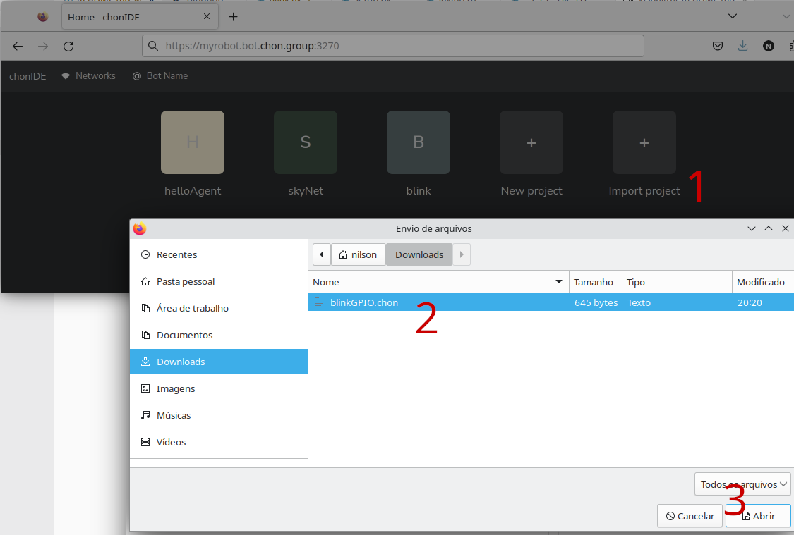
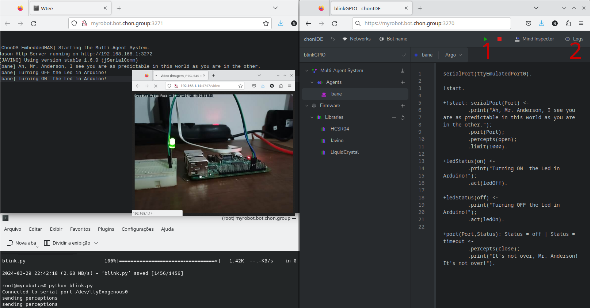

# Javino Library for Python

This repository provides the Javino protocol for Raspberry boards. Javino is a serial message's error check protocol for exchanging messages between high-end and low-end IoT devices over serial communication.

When a high-level software needs to act in the environment, it is necessary to transmit its command to the GPIO where the actuators are connected, providing a bridge between the software's external actions and the GPIO functions. In the same way, when the high-level software needs to sense the environment, the data perceived by sensors has to be sent.

There are some libraries that use the serial port to deal with one-sided messages. However, these libraries just provide message treatment for one platform side (the environment), leaving the other side to the programmer. The Javino aims to fill this gap because it offers a double-sided communication that provides a higher level of correctness in message exchange.

For this reason, every message is composed of a preamble, a field size and the message content. The preamble is a field composed of four hexadecimal characters that are used to identify the beginning of a message sent by an agent. The field size is composed of two hexadecimal characters that are used to calculate the message extension. Finally, the last field is the message content, up to 255 bytes. The preamble and the field size are used together to avoid errors in the event of a loss of information during the message transmission. For the sake of practice, Javino automatically mounts the message.


## How to install?
We consider that you are using the last version of [chonOS](https://chonos.sf.net/) <sup>[\[how to install the chonOS\]](https://docs.google.com/document/d/1vNFF5BW73UKxvOMUaiKSjbKSz3Kq5z7TSr4vD3TmAbM/edit?usp=sharing)</sup>.

### 1 - Updating the chonOS and installing deps
Connect via SSH in your ChonOS system and execute the commands below:

```bash
chonosUpdate 
apt install raspberrypi-kernel-headers chonos-serial-port-emulator 
reboot
```
If all is correct, your prompt will appears like below:


### 2 - Installing the Javino Library for Pythion
After reboot, connect in your chonOS (via SSH) again and execute the command below

```bash
pip3 install https://github.com/chon-group/javino2python/releases/latest/download/javino-latest-py3-none-any.whl
```
If all is correct, your prompt will appears like below:


## How to use?
### 1 Download and execute the Blink GPIO Example 
We are considering that your Raspberry Pi has an LED plugged in the GPIO 18, running the [chonOS](https://chonos.sf.net/)<sup>[\[how to install the chonOS\]](https://docs.google.com/document/d/1vNFF5BW73UKxvOMUaiKSjbKSz3Kq5z7TSr4vD3TmAbM/edit?usp=sharing)</sup> like the schematic below:


Connect in your chonOS (via SSH) and execute the command below
```
wget https://raw.githubusercontent.com/chon-group/javino2python/main/examples/blink/python/blink.py
python3 blink.py 
```
If all is correct, your prompt will appears like below:


### 2 Importing an BlinkGPIO multi-agent system example
Using a browser, access the chonIDE embedded in the Raspberry Pi https://YOUR-BOT-NAME.bot.chon.group:3270/


Donwnload this [multi-agent system example](https://raw.githubusercontent.com/chon-group/javino2python/main/examples/blink/multi-agentSystem/blinkGPIO.chon)

Import the multi-agent system project in chonIDE



### 3 Executing the example




## COPYRIGHT
<a rel="license" href="http://creativecommons.org/licenses/by/4.0/"></a><br />Javino is licensed under a <a rel="license" href="http://creativecommons.org/licenses/by/4.0/">Creative Commons Attribution 4.0 International License</a>. The licensor cannot revoke these freedoms as long as you follow the license terms:

* __Attribution__ — You must give __appropriate credit__ like below:

N. M. Lazarin e C. E. Pantoja, “A robotic-agent platform for embedding software agents using raspberry pi and arduino boards”, _in_ __Proceedings of 9th Software Agents, Environments and Applications School (WESAAC 2015)__, Niteroi: UFF, 2015, p. 13–20. Available at: [http://www2.ic.uff.br/~wesaac2015/Proceedings-WESAAC-2015.pdf](https://www.researchgate.net/publication/277403727_A_Robotic-agent_Platform_for_Embedding_Software_Agents_Using_Raspberry_Pi_and_Arduino_Boards)

<details>
<summary> Cite using Bibtex </summary>

```
@inproceedings{javino,
	address = {Niteroi - RJ},
	title = {A robotic-agent platform for embedding software agents using raspberry pi and arduino boards},
	url = {http://www2.ic.uff.br/~wesaac2015/Proceedings-WESAAC-2015.pdf},
	booktitle = {Proceedings of 9th Software Agents, Environments and Applications School (WESAAC 2015)},
	publisher = {UFF},
	author = {Lazarin, Nilson Mori and Pantoja, Carlos Eduardo},
	year = {2015},
	pages = {13--20},
	note = {ISSN: 2177-2096},
}
```
</details>